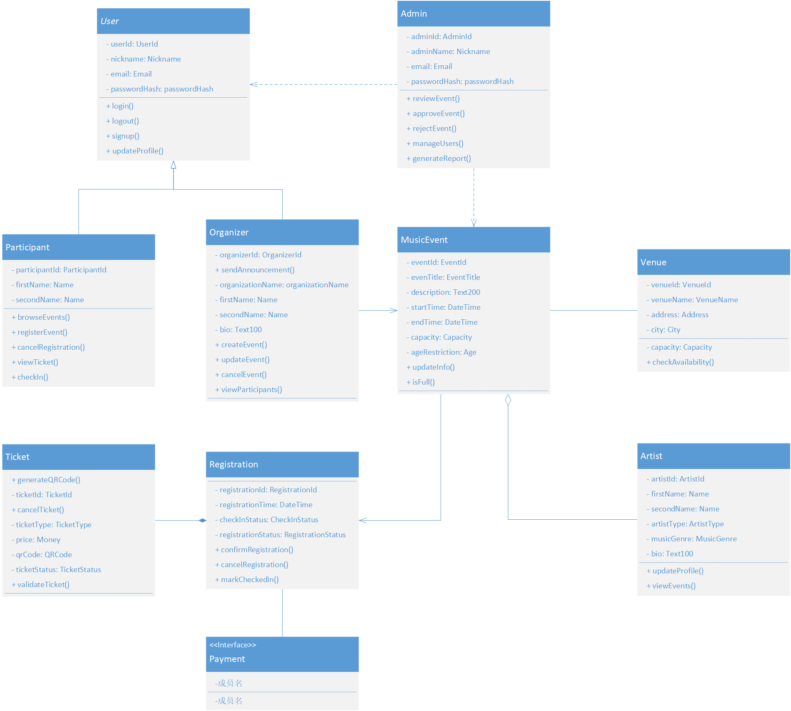

# SoundWave Events

SoundWave Events is a Python Flask MVC web application for music event browsing, event creation, registration, ticketing, venue management, artist participation, payment, and admin event review.

The project currently contains the Flask MVC structure, SQLAlchemy ORM models, Blueprint routes, Jinja2 templates, Bootstrap-based frontend pages, and domain value object classes. Many business methods are intentionally left as method declarations with `return`, so the next developer can complete the internal logic.

## Environment

Use Python:

```text
Python 3.14.6
```

Recommended conda environment:

```powershell
conda activate musicevent
```

If `conda activate musicevent` does not work in PowerShell, use:

```powershell
conda run -n musicevent python --version
```

## Install Dependencies

From the project root:

```powershell
cd music_event_app
pip install -r requirement.txt
```

The same dependencies are also kept in `requirements.txt`.

## Initialize Database

The project uses SQLite. The database file is stored at:

```text
instance/music_event.db
```

Create all tables:

```powershell
python init_db.py
```

## Run The Application

Start the Flask application:

```powershell
python run.py
```

Then open:

```text
http://127.0.0.1:5000
```

Useful pages:

```text
Home:                 http://127.0.0.1:5000/
Login / Signup:       http://127.0.0.1:5000/auth/login
Event detail:         http://127.0.0.1:5000/events/1
Create event:         http://127.0.0.1:5000/events/create
Booking history:      http://127.0.0.1:5000/participant/registrations
Participant dashboard http://127.0.0.1:5000/participant/dashboard
```

## UML Diagram

The UML diagram is stored here:



The diagram describes the core object-oriented design of the platform.

## UML Class Explanation

### User

`User` is the base class for normal platform users.

Fields:

- `user_id`
- `nickname`
- `email`
- `password_hash`

Methods:

- `login()`
- `logout()`
- `signup()`
- `updateProfile()`

### Participant

`Participant` inherits from `User`. A participant can browse events, register for events, view tickets, cancel registrations, and check in.

Fields:

- `participant_id`
- `first_name`
- `second_name`

Methods:

- `browseEvents()`
- `registerEvent()`
- `cancelRegistration()`
- `viewTicket()`
- `checkIn()`

### Organizer

`Organizer` inherits from `User`. An organizer can create and manage music events.

Fields:

- `organizer_id`
- `organization_name`
- `first_name`
- `second_name`
- `bio`

Methods:

- `createEvent()`
- `updateEvent()`
- `cancelEvent()`
- `viewParticipants()`
- `sendAnnouncement()`

### Admin

`Admin` is independent and does not inherit from `User`. It represents the platform administrator.

Fields:

- `admin_id`
- `admin_name`
- `email`
- `password_hash`

Methods:

- `reviewEvent()`
- `approveEvent()`
- `rejectEvent()`
- `manageUsers()`
- `generateReport()`

### MusicEvent

`MusicEvent` represents a music event created by an organizer.

Fields:

- `event_id`
- `event_title`
- `description`
- `start_time`
- `end_time`
- `capacity`
- `age_restriction`
- `event_status`
- `music_genre`

Methods:

- `publish()`
- `cancel()`
- `updateInfo()`
- `isFull()`

### Venue

`Venue` represents the physical place where events are hosted.

Fields:

- `venue_id`
- `venue_name`
- `address`
- `city`
- `room`
- `capacity`

Methods:

- `checkAvailability()`

### Artist

`Artist` represents a performer who can appear in many events.

Fields:

- `artist_id`
- `first_name`
- `second_name`
- `artist_type`
- `music_genre`
- `bio`

Methods:

- `updateProfile()`
- `viewEvents()`

### Registration

`Registration` connects a participant to a music event.

Fields:

- `registration_id`
- `registration_time`
- `registration_status`
- `check_in_status`

Methods:

- `confirmRegistration()`
- `cancelRegistration()`
- `markCheckedIn()`

### Ticket

`Ticket` belongs to one registration.

Fields:

- `ticket_id`
- `ticket_type`
- `price`
- `qr_code`
- `ticket_status`

Methods:

- `generateQRCode()`
- `validateTicket()`
- `cancelTicket()`

### Payment

`Payment` is a normal class, not an interface. A registration may have zero or one payment because free events may not need payment.

Fields:

- `payment_id`
- `amount`
- `payment_method`
- `payment_status`
- `payment_time`

Methods:

- `pay()`
- `refund()`
- `verifyPayment()`

## UML Relationships

- `Participant` inherits from `User`.
- `Organizer` inherits from `User`.
- `Admin` does not inherit from `User`.
- One `Organizer` can create many `MusicEvent` records.
- One `MusicEvent` belongs to one `Organizer`.
- `Admin` reviews, approves, and rejects `MusicEvent` records.
- One `Venue` can host many `MusicEvent` records.
- One `MusicEvent` is held at one `Venue`.
- `MusicEvent` and `Artist` have a many-to-many relationship through the `event_artist` association table.
- One `Participant` can have many `Registration` records.
- One `MusicEvent` can have many `Registration` records.
- One `Registration` belongs to one `Participant` and one `MusicEvent`.
- One `Registration` can generate one `Ticket`.
- One `Ticket` belongs to one `Registration`.
- One `Registration` can have zero or one `Payment`.
- One `Payment` belongs to one `Registration`.

## Project Structure

```text
music_event_app/
├── app/
│   ├── controllers/
│   ├── domain/
│   │   └── value_objects/
│   ├── forms/
│   ├── models/
│   ├── routes/
│   ├── services/
│   ├── static/
│   ├── templates/
│   └── views/
├── instance/
├── pic/
│   └── uml.png
├── config.py
├── init_db.py
├── main.py
├── requirement.txt
├── requirements.txt
└── run.py
```

## Notes For The Next Developer

- The frontend prototype pages have been merged into Flask templates.
- Static CSS and images are stored under `app/static/`.
- Important domain datatypes are represented as classes in `app/domain/value_objects/`.
- Business logic is not completed yet. Many methods intentionally contain only `return`.
- Routes are thin and should call service classes when business logic is implemented.
